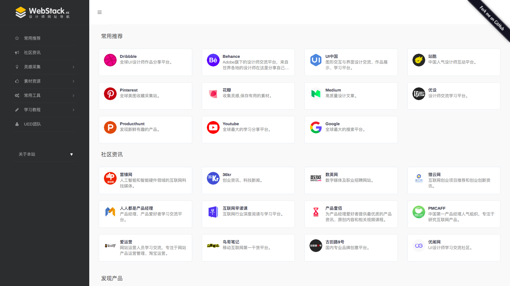
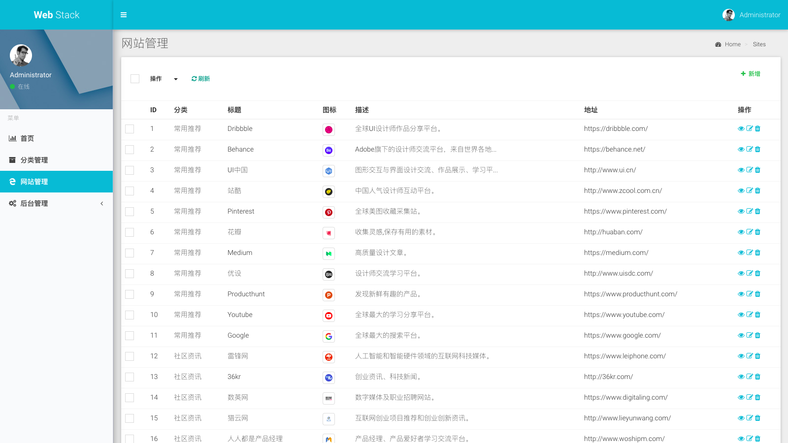

# WebStack-Laravel

一个开源的网址导航网站项目，具备完整的前后台，您可以拿来制作自己的网址导航。这是个修改版本_V2.0，修复了安装composer依赖报错问题以及后台登录重定向和后台不能提交数据的问题。
欢迎使用交流：



## 部署

克隆代码：

```shell
git clone https://github.com/ReoTok/WebStack-Laravel.git
```

1）安装依赖：

```shell
$ composer install
```

2）编辑配置：

```
$ cp .env.example .env
```

```
...
DB_DATABASE=your-database
DB_USERNAME=your-db-username
DB_PASSWORD=your-db-password
...
```

3）生成 KEY：

```shell
$ php artisan key:generate  
```

4）迁移数据：

```shell
php artisan migrate:refresh --seed
```

5）设置public为网站访问目录

6）设置伪静态，Laravel5伪静态 nginx代码如下：

```shell
location / { 
try_files $uri $uri/ /index.php$is_args$query_string; 
}
```

本地测试：

```shell
$ php artisan serve
```

安装完成：http://127.0.0.1:8000

> 有些朋友对部署表示有压力，但这和一般的 Laravel 应用是没有区别的，线上环境可以参考：https://github.com/summerblue/laravel-ubuntu-init

## 使用

后台地址：http://yourdomain/admin

默认用户：admin

默认密码：admin




## 其他

1. 本应用预设了一些站点数据，可以使用以下命令清除：

```shell
$ php artisan webstack:clean
```

2. 修改管理员admin密码请使用命令：
   
   ```shell
   $ 首先进入对应的网站根目录 cd /your website-root-dir
   $ php artisan admin:reset-password
       Please enter a username who needs to reset his password: 
        >
   $ 输入 admin 回车
   $ 然后输入密码。
   ```

3. 如果有需要隐藏后台 /admin 管理入口请修改此处：
   
   ```shell
   $ 修改文件 /wwwroot/config/admin.php
   $ 第49行
       'route' => [
   
           'prefix' => 'admin',
   
           'namespace' => 'App\\Admin\\Controllers',
   
           'middleware' => ['web', 'admin'],
       ],
   $ 只修改 prefix 的值为你喜欢的，比如 your-text, 然后保存；
   $ 重新刷新访问后台http://your-domain/your-text ,
   $ Enjoy!
   ```

4. 站点title修改在根目录.env文件处第一行 APP_NAME=你的站点名称

5. Header信息修改在  /webroot/resources/views/layouts/header.blade.php

## 感谢

前端设计：[**WebStackPage**](https://github.com/WebStackPage/WebStackPage.github.io)

后台框架：[**laravel-admin**](https://github.com/z-song/laravel-admin)

## License

GPL-3.0
